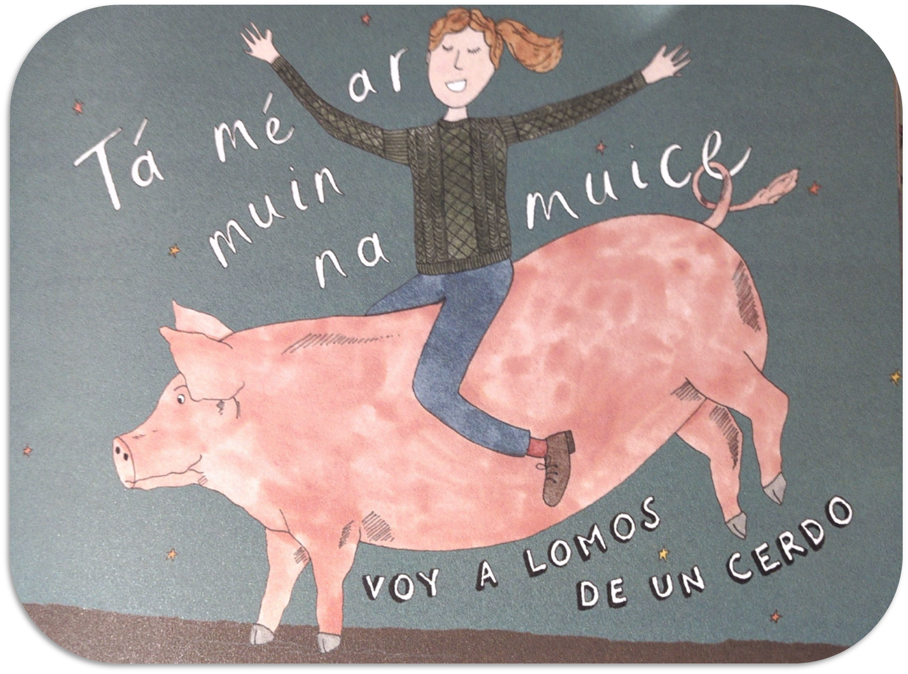

# Bienvenida a DAT {.unnumbered}

{fig-align="center" width="400"}

La asignatura de **Documentación Aplicada a la Traducción** es de carácter instrumental y tiene el objetivo de introduciros de manera crítica en el manejo de las fuentes de información y de la tecnología para el trabajo de la traducción y académico en general. Se trata de una introducción en las normas de citación y escritura académica, selección y manejo de fuentes de información y desarrollo de estrategias de identificación, filtrado y validación de información relevante y veraz.

El objetivo final es que adquiráis las competencias necesarias y el pensamiento crítico para ser autónomos en la búsqueda de soluciones a la hora de documentaros, automatizar flujos de trabajo y establecer modelos colaborativos.

::: right
**Nicolás Robinson-Garcia**
:::

## Cómo usar estos materiales

Cada tema está organizado en sesiones de dos horas que combinan contenido teórico y prácticas. Las prácticas de clase y los entregables individuales están descritos al final de cada sesión.

Los materiales se actualizan de forma continua. Si encuentras algún error o tienes sugerencias, puedes abrir un *issue* en el repositorio usando el enlace de la barra superior.

## Contacto

Para dudas sobre el contenido, usa el foro de la asignatura en PRADO. Para cuestiones administrativas, contacta por correo institucional.
