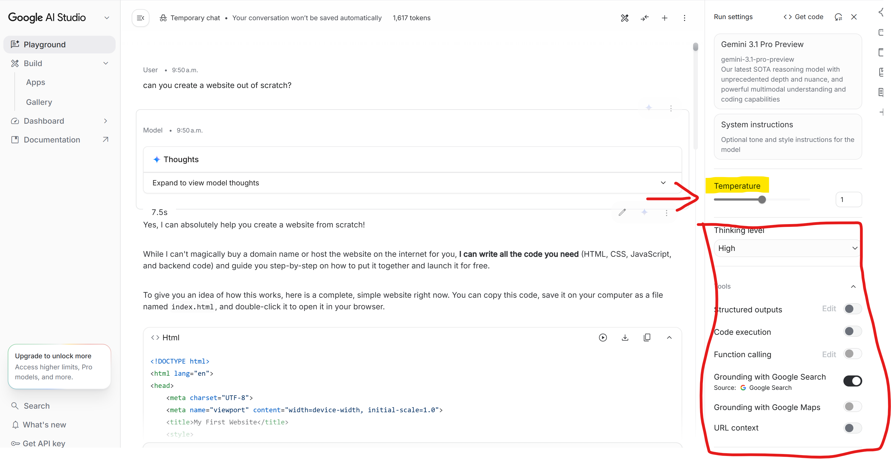

# Ingeniería de prompts

## Replicabilidad y control en la respuesta

Cuando lanzas el mismo prompt dos veces, el modelo no da exactamente la misma respuesta. Esto no es un fallo: es una decisión de diseño. Los LLMs tienen parámetros que controlan cuánta variabilidad hay en sus respuestas, y entenderlos te permite decidir cuándo quieres creatividad y cuándo quieres consistencia. Esto lo hacen a través de dos parámetros:

- La **temperatura**, que controla cuánta aleatoriedad introduce el modelo al elegir la siguiente palabra.

{fig-align="center" width="470"}

| Temperatura | Comportamiento | Cuándo usarla |
|---:|----|----|
| **0.0 - 0.3** | Prácticamente determinista. Ante el mismo prompt en condiciones idénticas, el modelo tenderá a dar la misma respuesta. | Útil para extracción de datos, terminología, traducciones o tareas que deban replicarse. Limitada si queremos hacer *brainstorming* o queremos que sea 'creativo' en su respuesta. |
| **0.4 - 0.7** | Equilibrio entre coherencia y variedad. La probabilidad permite más variabilidad en la respuesta, dando respuestas más diversas, pero controlando la probabilidad de respuesta aún | Útil para redacciones, análisis o explicaciones para el usuario |
| **0.8 - 1.0** | Más creativa, menos predecible, más probabilidad de alucinación, ya que hay mayor aletoriedad en las respuestas que da, incluyendo texto plausible aunque no necesariamente correcto. | Útil para hacer brainstorming, pelotear ideas o redactar textos creativos |

- El **top-p** o *nucelus sampling*, que trabaja de forma complementaria a la temperatura. En lugar de controlar cuánta aleatoriedad hay en general, controla el tamaño del conjunto de palabras entre las que el modelo puede elegir.

  > Imagínate que le damos un valor de `top-p = 0.1`, el modelo solo considera las palabras que juntas acumulan el 10% de probabilidad: es decir, sólo las más probables. Con `top-p = 0.9`, considera un conjunto mucho más amplio de palabras posibles.

En la práctica, temperatura y top-p actúan juntos. La mayoría de herramientas de uso general como Gemini no exponen estos parámetros directamente, pero AI Studio sí permite ajustarlos, lo que te da control total sobre el comportamiento del modelo.

::: callout-note
## Modos indirectos de influir en los parámetros

No puedes cambiar la temperatura directamente desde la interfaz de un chatbot. Normalmente esto se hace cuando uno se conecta a estos sistemas a través de una API. Sin embargo, puedes conseguir un efecto similar instruyendo al modelo en el propio prompt:

- *"Dame siempre la misma respuesta para este tipo de consulta"* → empuja hacia consistencia
- *"Dame cinco opciones muy distintas entre sí"* → empuja hacia variedad

No es lo mismo que controlar el parámetro directamente, pero puede funcionar para la mayoría de casos.
:::

::: {.callout-tip appearance="simple"}
## ¿Qué es una API?

[Una API (Application Programming Interface) es una forma de comunicarse con un programa sin necesidad de usar su interfaz visual.]{.underline} Cuando usas ChatGPT a través del navegador, interactúas con una interfaz diseñada para humanos. Cuando accedes a través de la API, le mandas instrucciones directamente en forma de código y recibes la respuesta también en código, sin pantallas ni botones de por medio.

Esto es importante porque a partir de las APIs podemos integrar un LLM dentro de otras herramientas: un gestor de traducciones, una hoja de cálculo, un flujo de trabajo automatizado. En lugar de abrir el chat y copiar y pegar, el programa habla directamente con el modelo y procesa los resultados automáticamente.
:::

## Tipos de prompts

Un prompt no es solo una pregunta. Según cómo lo construyas, el modelo activará estrategias de respuesta muy distintas. Conocer estas técnicas te permite elegir la más adecuada para cada tarea en lugar de improvisar cada vez.

### Zero-shot prompting

Le pides al modelo que haga algo sin darle ningún ejemplo ni contexto adicional. Es el punto de partida más simple y funciona bien para tareas directas y bien definidas.

```         
Traduce el siguiente término jurídico al inglés británico: 
"resolver el contrato de pleno derecho"
```

**Cuándo funciona bien:** consultas terminológicas directas, preguntas factuales, tareas con un output muy claro.

**Cuándo falla:** cuando la tarea requiere un formato muy específico, cuando el dominio es muy especializado o cuando necesitas que el modelo adopte un criterio concreto que no está en su entrenamiento general.

### Few-shot prompting

Antes de pedir la tarea, le muestras al modelo uno o varios ejemplos del output que esperas. El modelo aprende el patrón de tus ejemplos y lo replica.

```         
Aquí tienes ejemplos de cómo quiero que presentes las entradas del glosario:

Término: despechá
Categoría: andalucismo / apócope
Definición: forma apocopada de "despechada", con elisión de la -d- 
intervocálica característica del habla andaluza
Reto de traducción: la apócope es intraducible fonéticamente en inglés; 
se pierde el marcador dialectal
Propuesta: "done with you" (pérdida del rasgo dialectal aceptada)

Ahora haz lo mismo con estos términos: [lista de términos]
```

**Cuándo funciona bien:** cuando necesitas un formato de salida exacto y consistente, cuando construyes un glosario o tabla con estructura definida, cuando el zero-shot te da respuestas correctas pero mal formateadas.

**Cuándo falla:** si los ejemplos que das tienen inconsistencias, el modelo las replica. Basura entra, basura sale.

### Chain-of-Thought (CoT) prompting

Le pides al modelo que razone paso a paso antes de dar la respuesta final. Esto mejora significativamente los resultados en tareas que requieren análisis, comparación o justificación. Sería una forma *artificial* de obligar al modelo a que razone o piense.

```         
Analiza si el término "motomami" tiene equivalente en inglés. 
Razona tu respuesta siguiendo estos pasos: 
primero explica qué significa el término y de dónde viene, 
luego evalúa si existe un concepto equivalente en la cultura anglófona, 
y finalmente propón la estrategia de traducción más adecuada 
justificando tu elección.
```

**Cuándo funciona bien:** análisis de equivalencias complejas, justificación de decisiones traductológicas, evaluación de opciones cuando no hay una respuesta única correcta.

**Cuándo falla:** para tareas simples y directas es innecesario y hace las respuestas más largas sin añadir valor. Si le pides que razone por qué "cat" se traduce como "gato", el resultado es ridículo.

### Role prompting

Le asignas al modelo un rol específico para que ajuste su base de conocimiento, su tono y sus criterios al perfil que necesitas.

```         
Eres un traductor especializado en música urbana hispanohablante 
con experiencia en localización cultural para el mercado anglosajón. 
Tu criterio prioritario es preservar el impacto cultural del texto 
aunque eso implique pérdidas formales. Con ese criterio, 
propón una traducción al inglés de esta estrofa de Bad Bunny: [estrofa]
```

**Cuándo funciona bien:** cuando necesitas que el modelo adopte un criterio profesional específico, cuando quieres simular la perspectiva de un revisor, un cliente o un experto en un dominio concreto.

**Cuándo falla:** el modelo acepta el rol pero no siempre lo mantiene de forma consistente a lo largo de una conversación larga. Conviene recordárselo si la sesión se extiende.

### Combinando técnicas

Las técnicas anteriores no son excluyentes. En la práctica, los prompts más efectivos combinan varias:

```         
[Role] Eres un terminólogo especializado en música urbana.
[CoT] Analiza el término "perreo" siguiendo estos pasos: 
origen, connotaciones culturales, registro, presencia en otras lenguas.
[Few-shot] Presenta el resultado en este formato:

Término: [término]
Origen: [origen]
Connotaciones: [connotaciones]
Registro: [registro]
Equivalente propuesto: [equivalente]
Estrategia: [estrategia de traducción]

[Zero-shot para el contenido] Ahora aplica este análisis a: 
perreo, flow, jangueo
```

::: callout-important
## 💡Very important

[La técnica de prompting no determina la calidad del resultado por sí sola]{.underline}. Un few-shot con ejemplos malos produce outputs malos con mucha consistencia. Un role prompt con un rol mal definido produce respuestas genéricas con apariencia de especialización. La técnica es el vehículo: el criterio es tuyo.
:::

------------------------------------------------------------------------

## Prácticas

::: {.callout-note icon="false"}
### Ejercicio - Creación de contenido interactivo con Gemini {#practica-3}

**Tarea.** En esta práctica vas a usar Gemini Canvas para construir una página web de análisis terminológico sobre un artista o grupo musical a tu elección. La única condición es que debe ser alguien que o bien combine distintos idiomas o utilice expresiones especialmente distintivas. Yo te voy a sugerir dos si estás escasa de imaginación:

- Rosalia
- Bad Bunny
- Stromae

Para ello vamos a trabajar con la opción de Canvas de [Gemini](https://gemini.google.com). Canvas es un generador y editor de textos que no sólo permite generar texto, sino también convertirlo a diferentes formatos:

- Página web
- Infografía
- Cuestionario
- Tarjetas didácticas
- Resumen de audio

Nosotros trabajaremos con la de creación de páginas web. Esta página web deberás colgarla luego en Google Sites y pasarme el link. **¿Cómo se hace eso?** Pregúntale a Gemini 😮.

Estas son las tareas que deberás llevar a cabo:

1.  Buscar las letras de 3 canciones del artista y generar un corpus terminológico
2.  Crear una web que contenga estas cuatro secciones:
    1.  **Presentación del artista**. ¿Por qué es interesante desde el punto de vista de la traducción? Menciona al menos dos rasgos lingüísticos característicos.
    2.  **Análisis terminológico por canción.** Para cada canción, pídele al modelo que identifique las palabras más repetidas quitando preposiciones y artículos y organice en categorías lingüísticas. También tiene que incluirte un análisis terminológico de cada canción.
    3.  **Cinco retos de traducción**. Aquí deberás incluir expresiones o términos especialmente difíciles de traducir a la lengua que elijas, con una propuesta de solución razonada para cada uno
    4.  **Ficha de proceso**. Incluye aquí un resumen de técnicas de prompt empleadas.

Cuando lo tengas todo respóndeme a las siguientes preguntas:

1.  Enlace de la web generada
2.  ¿Con qué apartado te liaste o se lió más Gemini para crearlo? ¿Qué parte ha sido especialmente costosa y cómo lo has arreglado?
3.  ¿Hasta qué punto te sientes dueña del contenido de la web? ¿Se te ocurre un uso alternativo para utilizar esta herramienta en la creación de páginas web?
:::
